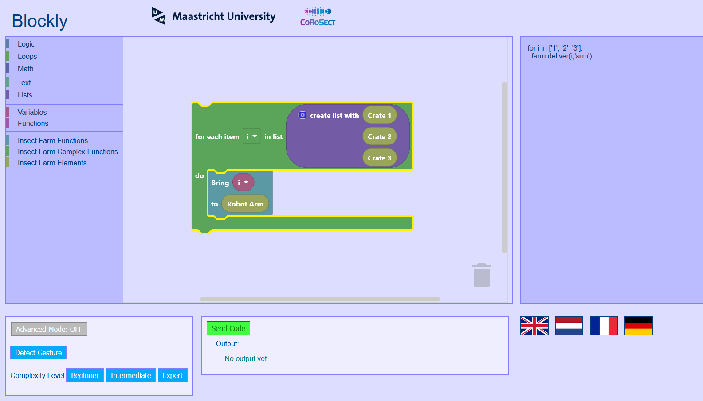
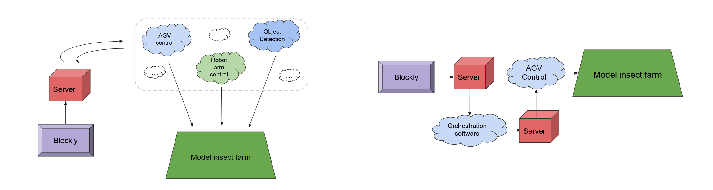

# Programming interfaces for non-experts

*Authors: Christophe Raso, Christopher Schiffmann, Gevorg Chakrian, Ingo Heijnens, Janis Eicher, Pepijn van der Meer*

Third-year Bsc DS&AI project, developed as part of [CoRoSect](https://corosect.eu/), a research collaboration between Maastricht University and [Field Lab Robotics](https://www.fieldlabrobotics.com/) aiming toward developing insect farms for sustainable food production. 

The goal of this project was to develop a programming interface which could be used by people without programming experience to control a model/demo insect farm, using [Google’s open-source Blockly project](https://developers.google.com/blockly) as a basis.

## Implementation

The front-end of the programming interface (i.e., what the user actually uses) can be found in the [/blockly](https://github.com/cjphs/DACS_3-1_9/tree/blockly) branch.

Due to Blockly's open-source nature & licensing, we were able to take it and modify it to suit our needs. Our modifications to the core Blockly project include:

- Code blocks for functions within the model insect farm
- Language switching (with support for English, Dutch, German, & French)
- Hiding/showing features based on user proficiency with programming
- A tutorial mode that guides the user through their first experience with the interface

The back-end, which can be found in the [/python-server](https://github.com/cjphs/DACS_3-1_9/tree/python-server) branch, interacts with other components of the model insect farm in order to execute specific actions. The right side of the following figure shows an example of such a procedure, where the Blockly interface (front-end) communicates with the server (back-end) and goes back and forth between the farm's orchestration software & AGV software in order to move the AGV (automatically-guided vehicle).

## Relevant guides

- [Installation guide](https://github.com/cjphs/DACS_3-1_9/blob/blockly_doc/guides/Installation%20guide.md)
- [Modifying & expanding the programming interface](https://github.com/cjphs/DACS_3-1_9/blob/blockly_doc/guides/Modification%20and%20expansion%20guide.md) (i.e., by adding new blocks)

